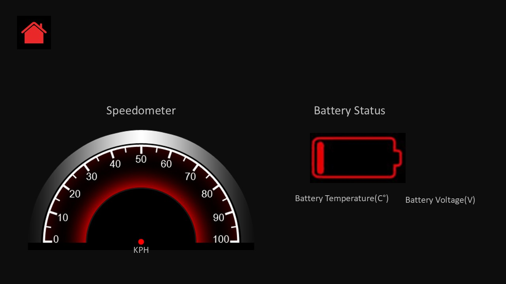

# Smart Car Dashboard System

[cite_start]This project presents the design and implementation of a **Smart Car Dashboard System** based on an embedded real-time architecture using an **STM32F407VGT6** microcontroller running **FreeRTOS**[cite: 8, 23]. [cite_start]The system monitors critical vehicle parameters and transmits data over a **Controller Area Network (CAN)** bus to an **ESP32 gateway** for cloud integration and visualization[cite: 9, 11].

---

## 🚀 System Overview

[cite_start]The system emulates a real-world automotive dashboard by integrating real-time data acquisition, robust in-vehicle communication, and cloud connectivity[cite: 29].

* [cite_start]**Vehicle ECU**: STM32F407VGT6 manages sensors and CAN communication using FreeRTOS tasks[cite: 10, 23].
* [cite_start]**Gateway ECU**: ESP32 receives CAN data via an MCP2515 module and forwards it to a DWIN LCD and AWS IoT[cite: 11, 25].
* [cite_start]**Cloud Integration**: Uses **MQTT protocol** over Wi-Fi to publish data to Amazon Web Services (AWS) IoT[cite: 12, 26].
* [cite_start]**HMI**: A **DWIN LCD** provides an interactive graphical interface for real-time visualization[cite: 13, 27].

---

## 🛠️ Hardware Architecture

### System Block Diagram

### Key Components
| Component | Purpose | Interface |
| :--- | :--- | :--- |
| **STM32F407VGT6** | [cite_start]Main Vehicle ECU (Data Processing) [cite: 91] | CAN, ADC, GPIO |
| **ESP32** | [cite_start]Gateway Controller (IoT & Display) [cite: 95] | SPI, UART, Wi-Fi |
| **SN65HVD230** | [cite_start]CAN Transceiver (Physical Layer) [cite: 100] | CAN |
| **MCP2515** | [cite_start]Standalone CAN Controller for ESP32 [cite: 106] | SPI |
| **DWIN LCD** | [cite_start]Dashboard Visualization (7-inch TFT) [cite: 112] | UART (DGUS) |

### Sensors Used
* [cite_start]**ACS712**: Measures battery charging and discharging current[cite: 124].
* [cite_start]**Voltage Sensor**: Monitors real-time battery voltage[cite: 129].
* [cite_start]**LM35**: Monitors battery and motor temperature for safety[cite: 136].
* [cite_start]**LM393**: Detects wheel/motor rotation for speed calculation[cite: 140].
* [cite_start]**Digital Switches**: Monitor door status and seatbelt status[cite: 170].

---

## 💻 Software Implementation

### Real-Time Operating System (FreeRTOS)
[cite_start]The STM32 utilizes FreeRTOS to manage concurrent tasks with deterministic timing[cite: 69, 246]:
1. [cite_start]**Task_SensorRead (High Priority)**: Acquires data from all sensors every 50ms[cite: 250, 251].
2. [cite_start]**Task_CANTransmit (Medium Priority)**: Formats data into CAN frames and transmits every 100ms[cite: 253, 254].
3. [cite_start]**Task_Monitor (Low Priority)**: Oversees system health and CAN bus-off conditions every 1000ms[cite: 256, 258].

### Communication Protocol (CAN)
* [cite_start]**Standard**: ISO 11898[cite: 172].
* [cite_start]**Baud Rate**: 500 kbps[cite: 272].
* [cite_start]**Mechanism**: Uses bit-wise arbitration based on message priority[cite: 209].

---

## 📈 Project Results

*The DWIN Display showing real-time Car Speed and Battery status.*

* [cite_start]**Data Accuracy**: Successfully acquired RPM, speed, temperature, and battery State of Charge (SOC)[cite: 266, 268].
* [cite_start]**Reliability**: Established robust CAN communication between STM32 and ESP32[cite: 272].
* [cite_start]**Cloud Connectivity**: Continuous data logging to AWS IoT via MQTT over Wi-Fi[cite: 278, 279].

---

## 📜 Authors (C-DAC, Pune)
* [cite_start]**Akash Dubey** (PRN: 250840130005) [cite: 2]
* [cite_start]**Allu Taraka Rama Sai Aravind** (PRN: 250840130008) [cite: 2]
* [cite_start]**Bhavesh Chandrashekhar Satkar** (PRN: 250840130010) [cite: 2]
* [cite_start]**Nadarge Shivam Santosh** (PRN: 250840130027) [cite: 2]
* [cite_start]**Sambaladeevi Gowtham** (PRN: 250840130042) [cite: 3]

[cite_start]**Guided by:** Mr. Shreepad Deshpande [cite: 1]
